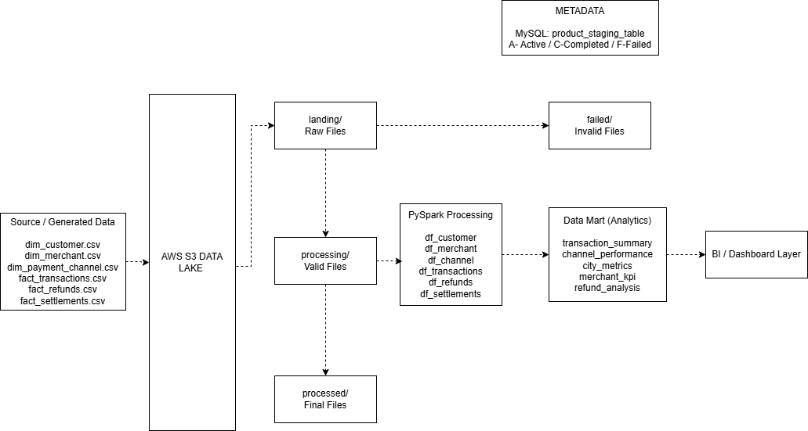
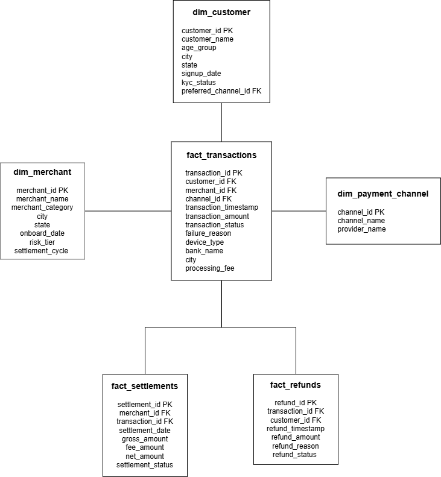
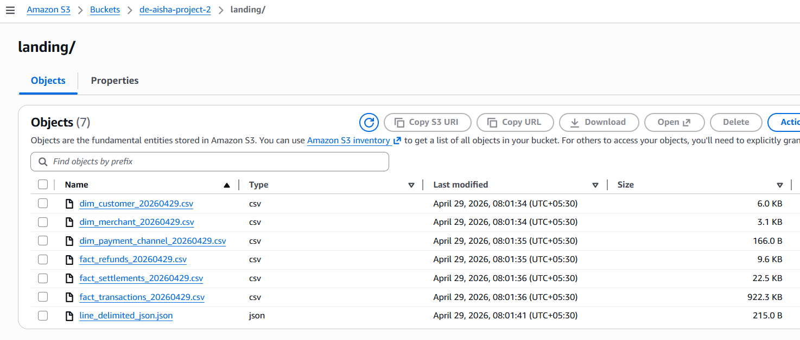
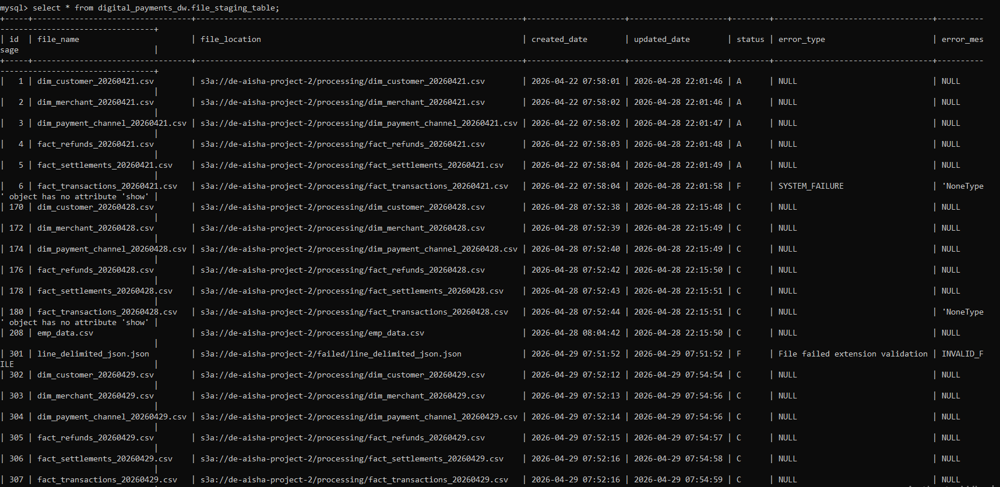
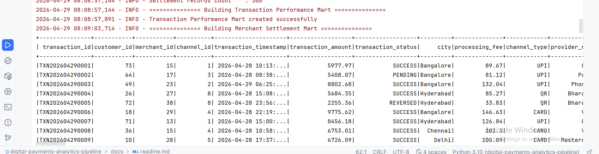
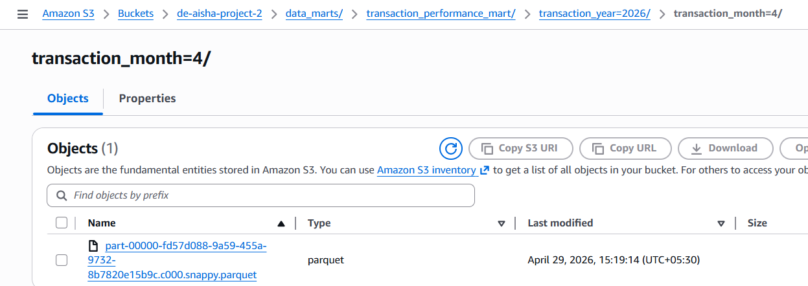
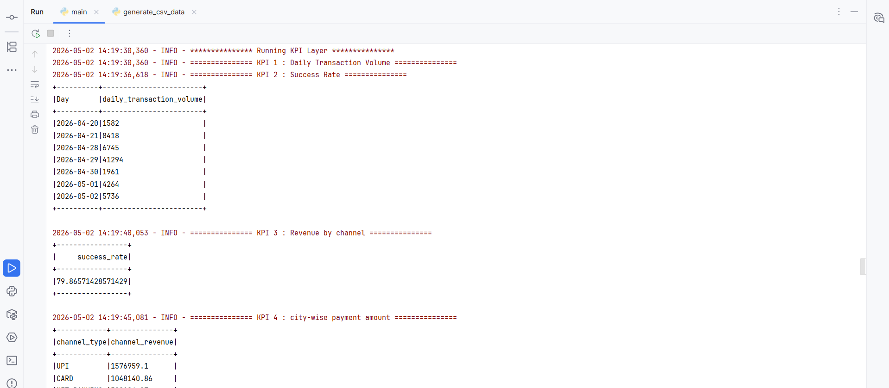
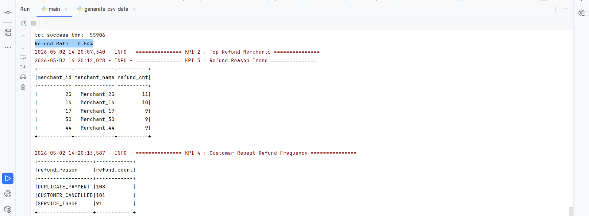
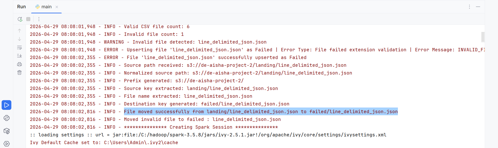
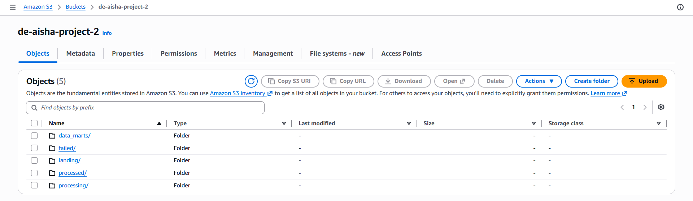

# Digital Payments Analytics Pipeline

**Failure-Resilient Batch Data Pipeline using PySpark & AWS**

---

## 📌 Overview

Built an end-to-end batch data pipeline to process digital payment transactions and generate curated datasets for business reporting.

The pipeline is designed to handle failures gracefully and support controlled reprocessing without introducing duplicate data.

---

## ⚠️ Problem

Digital payment systems generate high-volume data across transactions, settlements, and refunds. During ingestion, failures can occur due to system or network issues.

Without proper handling, this leads to:

- Duplicate data during reprocessing
- Inconsistent KPIs (e.g., success rate, revenue)
- Reduced trust in analytics

---

## ✅ Solution

Implemented a failure-aware batch pipeline with:

- Controlled retry mechanism for failed files
- Deduplication using business keys
- Consistent data marts for analytics

---
## Tech Stack

- **Languages** :- Python, SQL 
- **Data Processing** :- PySpark
- **Cloud & Storage** :- AWS S3, Parquet, CSV
- **Database** :- MySQL
- **Tools** :- Git, GitHub, PyCharm

---
## Architecture Diagram



---

## Data Model / Schema Diagram



---

## Source Files



---

## Control Table



---

## Data Mart Output





---

## KPI Output





---

## Failure Handling



---

## 📂 Data Lake Structure



```text
s3://bucket/

landing/       -> Incoming source files
processing/    -> Files under execution
processed/     -> Successfully processed files
failed/        -> Rejected / failed files

data_marts/
  transaction_performance_mart/
  merchant_settlement_mart/
  refund_insights_mart/
```
---

## ⚙️ Key Features

🔁 Controlled Reprocessing
- Tracks file status in a control table
- Retries only transient failures (SYSTEM_FAILURE, NETWORK_FAILURE)
- Re-injects failed files into the pipeline

♻️ Deduplication for Data Consistency
- Handles multi-file ingestion using unionByName
- Removes duplicates using primary/business keys
- Prevents duplicate records during reprocessing

📦 Multi-file Ingestion
- Supports multiple input files per dataset
- Combines and processes them as a unified dataset

🗂 File Lifecycle Management (S3)
- landing → processing → processed / failed
- Ensures traceability and clean execution flow

🧾 Control Table Tracking
- Tracks file states: Active, Completed, Failed
- Enables retry logic and pipeline observability

📊 Partitioned Data Marts
- Stored in Parquet format
- Partitioned by time (year/month) for efficient querying

---

## Pipeline Flow

1. Read files from landing zone
2. Validate file format
3. Move files to processing
4. Load into PySpark DataFrames
5. Apply joins and transformations
6. Deduplicate records
7. Build data marts
8. Write partitioned outputs
9. Update control table
10. Move files to processed/failed

---

## Data Marts & KPIs

#### 1. Transaction Performance Mart
- Daily transaction volume
- Success rate
- Revenue by channel
- City-wise transaction trends

#### 2. Merchant Settlement Mart
- Total settled amount
- Pending settlement %
- Top merchants by payout

#### 3. Refund Insights Mart
- Refund rate
- Refund reasons
- Repeat refund patterns

---

## Sample KPI Output
- Daily Transactions       : 10,000
- Success Rate            : 77.3%
- Top Revenue Channel     : UPI
- Highest Payment City    : Mumbai
- Refund Rate             : 1.29%
- Pending Settlements     : 12%
- Top Refund Reason       : Duplicate Payment

---

## How to Run

#### Prerequisites

- Python installed
- Java installed
- Spark configured locally
- MySQL installed
- AWS IAM user with S3 read/write access
- Required S3 bucket created

---

## Steps

#### 1. Clone Repository

```bash
git clone https://github.com/aishwaryap95/digital-payments-analytics-pipeline.git
cd digital-payments-analytics-pipeline
```
#### 2. Open in PyCharm

Import project and verify folder structure.

#### 3. Create Virtual Environment
```bash
python -m venv .venv
```
Activate environment:
```bash
.venv\Scripts\activate
```
#### 4. Install Dependencies
```bash
pip install -r requirements.txt
```
#### 5. Configure Credentials

Update AWS access key and secret key and project configs inside ../dev/config.py file.

#### 6. Generate Sample Source Files

Run data generator:
```bash
python src/test/generate_csv_data.py
```
This creates sample CSV files in local directory /spark_data.

#### 7. Upload Files to S3 Landing Zone

Run upload script:
```bash
python src/test/digital_payments_data_upload_to_s3.py
```
This uploads generated CSV files to the S3 landing zone.

#### 8. Run Pipeline
```bash
python src/main.py
```
---

## 🔮 Future Enhancements

- Workflow orchestration (Airflow)
- Data quality checks
- Monitoring & alerting

---

## Author

#### Aishwarya Patankar
Data Engineer | PySpark | SQL | AWS 